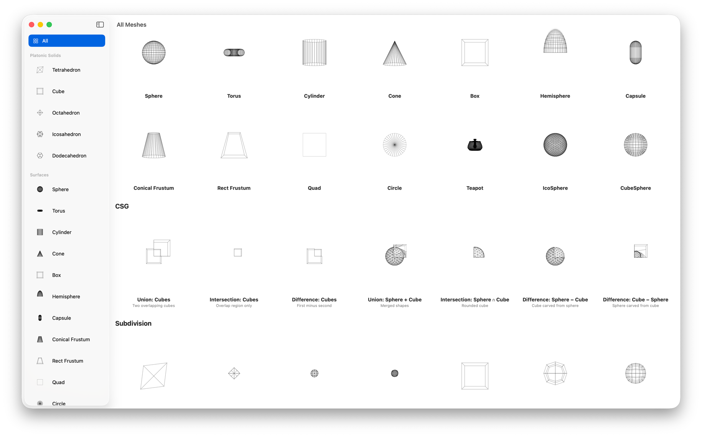

# SwiftMesh

Mesh data structures and operations for Swift. Half-edge topology, n-gon faces, SoA attributes, Metal export.



## Quick start

```swift
import SwiftMesh

let mesh = Mesh.cube
    .withSmoothNormals()
    .withSphericalUVs()

let metalMesh = MetalMesh(mesh: mesh, device: device)
encoder.draw(metalMesh)
```

## Types

**`HalfEdgeTopology`** — half-edge wiring with no geometry. Adjacency queries, validation, boundary detection, edge deletion/collapse.

**`Mesh`** — topology + vertex positions + optional per-corner attributes (normals, UVs, tangents, colors). N-gon faces. Multi-material submeshes.

**`TriangleSoup`** — flat indexed triangles. Intermediate format for CSG and whole-mesh operations.

**`MetalMesh`** — GPU-ready triangulated buffers. Interleaved or separate buffer layouts.

**`SwiftMeshIO`** — PLY file import/export (ASCII).

## Loading & conversion

```swift
// From ModelIO
let mesh = MetalMesh(mdlMesh: mdlMesh, device: device)
let mesh = MetalMesh(mtkMesh: mtkMesh)
let mdlMesh = metalMesh.toMDLMesh(device: device)

// From PLY
let mesh = try PLY.read(from: data)
let data = PLY.write(mesh)

// Between types
let soup = TriangleSoup(mesh: mesh)        // Mesh → TriangleSoup
let mesh = soup.toMesh(weldTolerance: 1e-5) // TriangleSoup → Mesh
let metalMesh = MetalMesh(mesh: mesh, device: device) // Mesh → MetalMesh
let mesh = metalMesh.toMesh()              // MetalMesh → Mesh
```

## Shape primitives

```swift
// Platonic solids
Mesh.tetrahedron()     // 4 triangle faces
Mesh.cube()            // 6 quad faces
Mesh.octahedron()      // 8 triangle faces
Mesh.icosahedron()     // 20 triangle faces
Mesh.dodecahedron()    // 12 pentagon faces

// Surfaces
Mesh.sphere()          // UV sphere
Mesh.icoSphere()       // subdivided icosahedron
Mesh.cubeSphere()      // cube projected onto sphere
Mesh.torus()           // configurable major/minor radii
Mesh.cylinder()        // optional caps
Mesh.cone()            // optional base cap
Mesh.hemisphere()      // optional cap
Mesh.capsule()         // sphere-capped cylinder
Mesh.conicalFrustum()  // truncated cone, optional caps
Mesh.rectangularFrustum() // truncated box, optional caps
Mesh.box()             // unit box with quad faces
Mesh.quad()            // single quad
Mesh.triangle()        // single triangle
Mesh.circle()          // flat disc
Mesh.teapot()          // Utah teapot
```

## Operations

### Attributes

```swift
mesh.withFlatNormals()       // per-face normals
mesh.withSmoothNormals()     // averaged vertex normals
mesh.withSphericalUVs()      // spherical projection
mesh.withCylindricalUVs()    // cylindrical projection
mesh.withPlanarUVs()         // planar projection
mesh.withBoxUVs()            // box-mapped UVs
mesh.withTangents()          // MikkTSpace tangents (needs normals + UVs)
```

### Transforms

```swift
mesh.translated(by: [1, 0, 0])
mesh.scaled(by: 2.0)
mesh.scaled(by: [1, 2, 1])
mesh.rotated(by: quaternion)
mesh.transformed(by: matrix)
```

### Topology

```swift
mesh.triangulated()                    // n-gons → triangles
mesh.welded(tolerance: 1e-5)           // merge near-duplicate vertices, rebuild topology
mesh.mergingCoplanarFaces()            // merge adjacent coplanar faces back to n-gons
mesh.isManifold                        // true if closed 2-manifold (no boundary edges)
mesh.topology.validate()               // nil if valid, or error description
```

### Subdivision

```swift
mesh.loopSubdivided(iterations: 2)          // Loop (triangle meshes)
mesh.catmullClarkSubdivided(iterations: 2)  // Catmull-Clark (any polygon mesh)
```

### Decimation

```swift
mesh.decimated(ratio: 0.5)              // reduce to 50% of faces
mesh.decimated(targetFaceCount: 100)     // reduce to exact count
```

### CSG (Constructive Solid Geometry)

```swift
meshA.union(meshB)          // A ∪ B
meshA.intersection(meshB)   // A ∩ B
meshA.difference(meshB)     // A − B
```

## Requirements

- macOS 26+ / iOS 26+
- Swift 6.2+

## Dependencies

- [GeometryLite3D](https://github.com/schwa/GeometryLite3D)
- [MetalSupport](https://github.com/schwa/MetalSupport)
- [SwiftEarcut](https://github.com/schwa/SwiftEarcut)
- [MikkTSpace](https://github.com/mmikk/MikkTSpace) (vendored) — see [mikktspace.com](http://www.mikktspace.com/)
