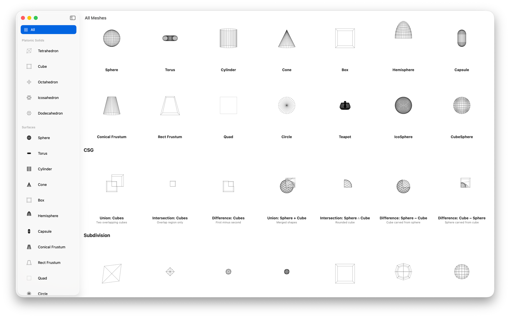

# SwiftMesh

Mesh data structures and operations for Swift. Half-edge topology, n-gon faces, SoA attributes, Metal export.



## Quick start

```swift
import SwiftMesh

let mesh = Mesh.cube()
    .withSmoothNormals()
    .withSphericalUVs()

let metalMesh = MetalMesh(mesh: mesh, device: device)
encoder.draw(metalMesh)
```

## Types

**`HalfEdgeTopology`** — half-edge wiring with no geometry. Adjacency queries, validation, boundary detection, edge deletion/collapse.

**`Mesh`** — topology + vertex positions + optional per-corner attributes (normals, UVs, tangents, colors). N-gon faces. Multi-material submeshes.

**`Mesh2D<ID>`** — 2D analogue: topology + `CGPoint` positions + per-half-edge labels. Planar subdivision construction from line segments, signed-area face classification, hole detection, boundary loop extraction, edge deletion with face merging.

**`TriangleSoup`** — flat indexed triangles. Intermediate format for CSG and whole-mesh operations.

**`MetalMesh`** — GPU-ready triangulated buffers. Interleaved or separate buffer layouts.

**`SwiftMeshIO`** — PLY file import/export (ASCII).

**`BinPacking`** — standalone MaxRects 2D bin packer. Used internally for atlas baking; also exposed as its own library product.

## Loading & conversion

```swift
// From ModelIO
let mesh = MetalMesh(mdlMesh: mdlMesh, device: device)
let mesh = MetalMesh(mtkMesh: mtkMesh)
let mdlMesh = metalMesh.toMDLMesh(device: device)

// From PLY
let mesh = try PLY.read(from: data)
let data = PLY.write(mesh)

// Between types
let soup = TriangleSoup(mesh: mesh)        // Mesh → TriangleSoup
let mesh = soup.toMesh(weldTolerance: 1e-5) // TriangleSoup → Mesh
let metalMesh = MetalMesh(mesh: mesh, device: device) // Mesh → MetalMesh (lossy)
let metalMesh = MetalMesh(mesh: mesh, device: device, preserveTopology: true) // lossless
let mesh = metalMesh.toMesh()              // MetalMesh → Mesh
```

## Shape primitives

```swift
// Platonic solids
Mesh.tetrahedron()     // 4 triangle faces
Mesh.cube()            // 6 quad faces
Mesh.octahedron()      // 8 triangle faces
Mesh.icosahedron()     // 20 triangle faces
Mesh.dodecahedron()    // 12 pentagon faces

// Surfaces
Mesh.sphere()          // UV sphere
Mesh.icoSphere()       // subdivided icosahedron
Mesh.cubeSphere()      // cube projected onto sphere
Mesh.torus()           // configurable major/minor radii
Mesh.cylinder()        // optional caps
Mesh.cone()            // optional base cap
Mesh.hemisphere()      // optional cap
Mesh.capsule()         // sphere-capped cylinder
Mesh.conicalFrustum()  // truncated cone, optional caps
Mesh.rectangularFrustum() // truncated box, optional caps
Mesh.box()             // unit box with quad faces
Mesh.quad()            // single quad
Mesh.triangle()        // single triangle
Mesh.circle()          // flat disc
Mesh.teapot()          // Utah teapot

// Procedural
Mesh.convexHull(of: points)            // 3D convex hull (incremental)
Mesh.marchingCubes(from: sdf, ...)     // isosurface from SDF
Mesh.wireframe(of: mesh, radius: r)    // "phat" wireframe — prisms along edges
```

## Operations

### Attributes

```swift
mesh.withFlatNormals()       // per-face normals
mesh.withSmoothNormals()     // averaged vertex normals
mesh.withSphericalUVs()      // spherical projection
mesh.withCylindricalUVs()    // cylindrical projection
mesh.withPlanarUVs()         // planar projection
mesh.withBoxUVs()            // box-mapped UVs
mesh.withTangents()          // MikkTSpace tangents (needs normals + UVs)
```

### Transforms

```swift
mesh.translated(by: [1, 0, 0])
mesh.scaled(by: 2.0)
mesh.scaled(by: [1, 2, 1])
mesh.rotated(by: quaternion)
mesh.transformed(by: matrix)
```

### Topology

```swift
mesh.triangulated()                    // n-gons → triangles
mesh.welded(tolerance: 1e-5)           // merge near-duplicate vertices, rebuild topology
mesh.mergingCoplanarFaces()            // merge adjacent coplanar faces back to n-gons
mesh.isManifold                        // true if closed 2-manifold (no boundary edges)
mesh.topology.validate()               // nil if valid, or error description
```

### Subdivision

```swift
mesh.loopSubdivided(iterations: 2)          // Loop (triangle meshes)
mesh.catmullClarkSubdivided(iterations: 2)  // Catmull-Clark (any polygon mesh)
```

### Decimation

```swift
mesh.decimated(ratio: 0.5)              // reduce to 50% of faces
mesh.decimated(targetFaceCount: 100)     // reduce to exact count
```

### CSG (Constructive Solid Geometry)

```swift
meshA.union(meshB)          // A ∪ B
meshA.intersection(meshB)   // A ∩ B
meshA.difference(meshB)     // A − B
```

### Merging

```swift
Mesh.merged([meshA, meshB, meshC])  // concatenate; each source becomes a submesh
```

### Planar atlas baking

```swift
// Partition into connected coplanar charts, then bin-pack into a UV atlas.
let charts = mesh.planarCharts()
let (uvMesh, layout) = try mesh.bakingPlanarAtlas(
    texelsPerMeter: 256,
    atlasSize: [2048, 2048],
    padding: 2
)
// `uvMesh.textureCoordinates` is now filled; `layout.charts` describes each
// chart's atlas rect and plane basis (for splatting 3D data back into pixels).
```

## Design

- Faces are n-gon. Triangulation only happens at `MetalMesh` export.
- `HalfEdgeTopology` stores no geometry — pure wiring.
- `Mesh` is a thin wrapper: topology + SoA attribute arrays.
- Per-corner attributes use `HalfEdgeID` as key (each half-edge = one vertex in one face).
- `MetalMesh` layout is write-once export; interleave however the vertex descriptor dictates.
- Submeshes on `Mesh` are face groups (list of `FaceID`s). `MetalMesh` maps 1:1.
- `MetalMesh` optionally stores corner-table topology buffers (`opposites` + `vertToHalfedge`)
  when created with `preserveTopology: true`. The existing index buffer doubles as the
  half-edge→vertex map (V table). `opposites[h]` gives the twin half-edge (O table),
  `vertToHalfedge[v]` gives a representative outgoing half-edge per vertex. Boundary
  edges use `UInt32.max` as a sentinel. This makes `Mesh → MetalMesh → Mesh` lossless
  for triangle topology — without it, `toMesh()` rebuilds topology via position
  deduplication, which can lose twin wiring at attribute seams.

## Performance notes

**Mesh → MetalMesh** is O(total triangles) with constant work per corner (attribute lookup, byte interleaving, buffer copy). Negligible for small meshes. For large meshes (100K+ triangles), per-corner dictionary lookups and byte-level interleaving will be the bottleneck — not yet optimized.

**Triangulation** adds overhead for n-gon faces: each non-triangle face requires a 3D→2D projection and earcut pass. Triangle faces pass through with no extra work.

## Dependencies

- [GeometryLite2D](https://github.com/schwa/GeometryLite2D) — `LineSegment`, `Polygon`, `Identified` (used by `Mesh2D`)
- [GeometryLite3D](https://github.com/schwa/GeometryLite3D)
- [MetalSupport](https://github.com/schwa/MetalSupport)
- [SwiftEarcut](https://github.com/schwa/SwiftEarcut)
- [MikkTSpace](https://github.com/mmikk/MikkTSpace) (vendored) — see [mikktspace.com](http://www.mikktspace.com/)
